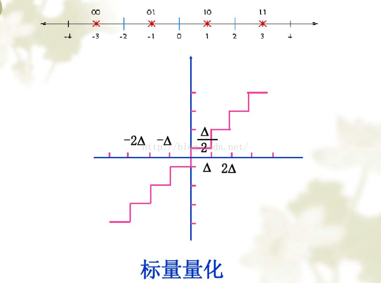
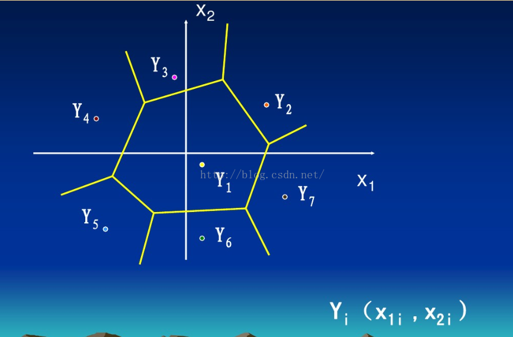
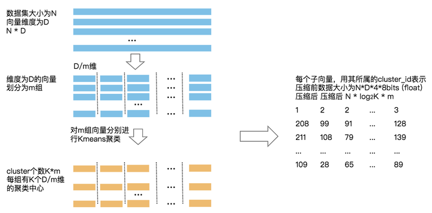

### 标量量化（scalar quantize）

将整个动态范围划分成若干个小区间（比如int8量化，共2**8 个区间）量化时，落入区间的信号值就用这个值代替。因为信号量是一维的，所以称为标量量化。

### 矢量量化（vector quantize）

同理，矢量量化是对矢量进行量化，把矢量空间分成若干个小区间（比如k = 256，就是聚类个数），落在区间的信号值就用这个代表值（聚类中心）代替。

### 乘积量化（product quantize）

乘积量化是将矢量维度D分成m组，分别对m组内数据进行聚类，得到k个聚类中心，这样的好处是，1）可以并行求解。2）相比矢量量化可以增大表示空间

### 三者关系

| 符号      | 说明       |
| --------- | ---------- |
| k         | 聚类个数   |
| D         | 向量维度   |
| N         | 样本个数   |
| m         | PQ分组个数 |
| $k^{D/m}$ | PQ分桶个数 |

标量量化和矢量量化本质是一样的，标量量化是将一堆数字映射到另一堆数字，矢量量化是将一堆向量映射到一堆向量，这些数字（向量）可以用idx表示，比如256个就可以用8bit表示

矢量量化和标量量化可以看成乘积量化的特殊情况，乘积量化处于矢量量化和标量量化中间：

标量量化-> 乘积量化：标量量化可以看成m = D, k = k（int8 就是256）的特殊情况

矢量量化 -> 乘积量化：矢量量化可以看成m = 1, k = k 的特殊情况

