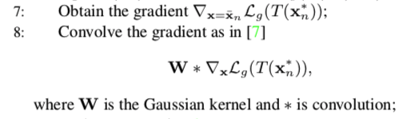
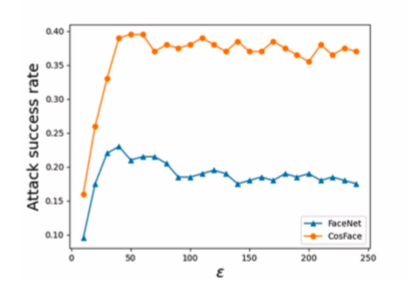

# Adversarial attack

## [An Adversarial Approach to Hard Triplet Generation](https://openaccess.thecvf.com/content_ECCV_2018/papers/Yiru_Zhao_A_Principled_Approach_ECCV_2018_paper.pdf)

#### Metric Learning

The goal of distance metric learning is to learn an embedding representation such that similar samples are mapped to nearby points on a manifold and dissimilar ones are mapped apart from each other

### Deepfake

### Improving Transferability of Adversarial Patches on Face Recognition with Generative Models

(RealAI 工作)

#### problem：

1. *the transferability is sensitive to initialization*; 

2. *degrades when the perturbation magnitude is large*

#### solution:

1. uses the face image of the **attacker** to initialize the patch -> use the face image of the **target** identity to initialize the patch 初始化的重要性

2. control the size of search space :  $|\mathbf{x} \odot \mathbf{M}|_{\infty} \leq \epsilon$ 更强的约束

#### Addition: 

梯度回传的时候加了高斯干扰

#### Ablation study：

1. Sensitivity to initialization：TAP-TIDIMv2 shows significantly higher success rates in black-box impersonation attack
2. Sensitivity to $\epsilon$ : 随着 $\epsilon$ 增大会提高成功率，但再大就会过拟合，反而降低成功率

