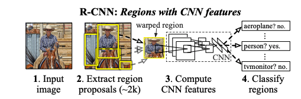

[TOC]

# Note:

1. Anchor的缺点
   1. sizes, aspect ratios, anchor number 敏感
   2. 需要针对场景目标设计anchor，对泛化性能有害
   3. 需要dense anchor来保证recall，但是大多anchor都是neg，造成imbalance sample
   4. 大量的anchor增加计算量
2. 现有的Anchor-free detection
   1. Yolo v1：在object center附近预测box
   2. CornerNet: 检测一对box corner
   3. Densebox family：不利于处理重叠框

# Object Detection with Deep Learning: A Review

paper link: <https://arxiv.org/pdf/1807.05511.pdf>

## key words

1. selective search
2. nms
3.  

## knowledge point

### R-CNN:

​	Region proposal generation -> CNN based extract feature -> Classification and localization

### SPP-net:

​	A spatial pyramid pooling layer :  project a feature map to a fixed-length vector。feature length: 256x(1^2+2^2+4^2)

### Fast R-CNN:

