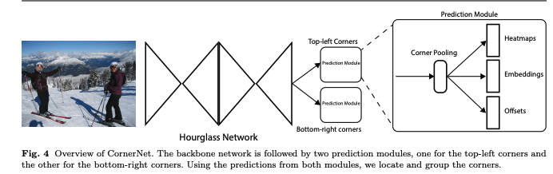
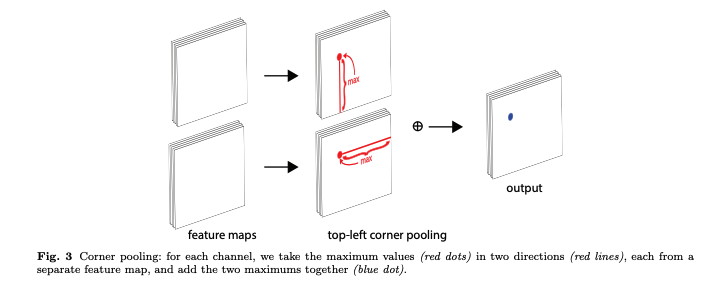
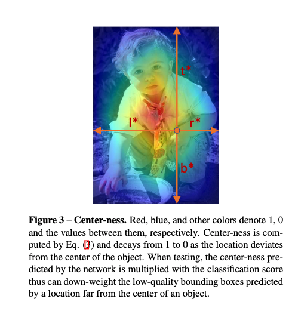
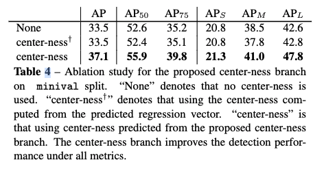
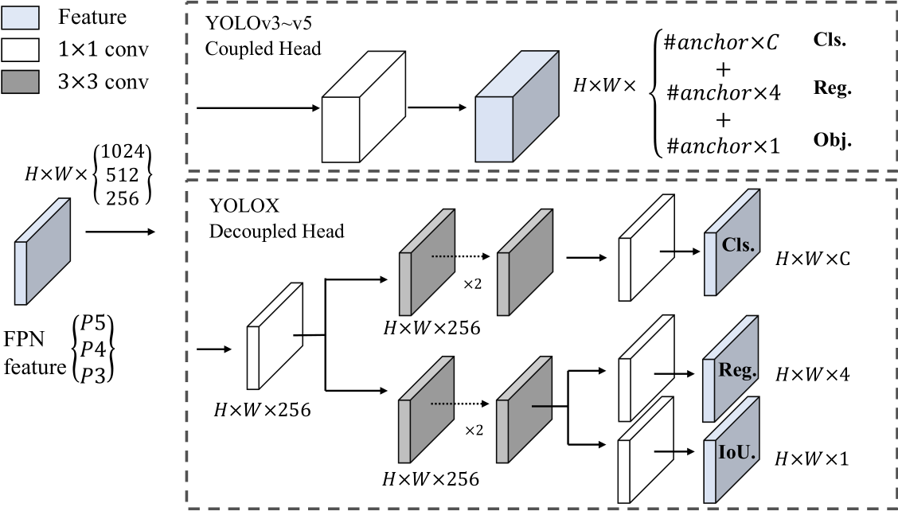
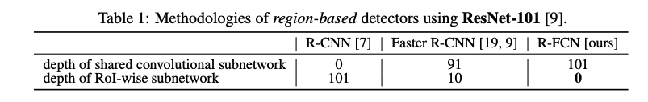
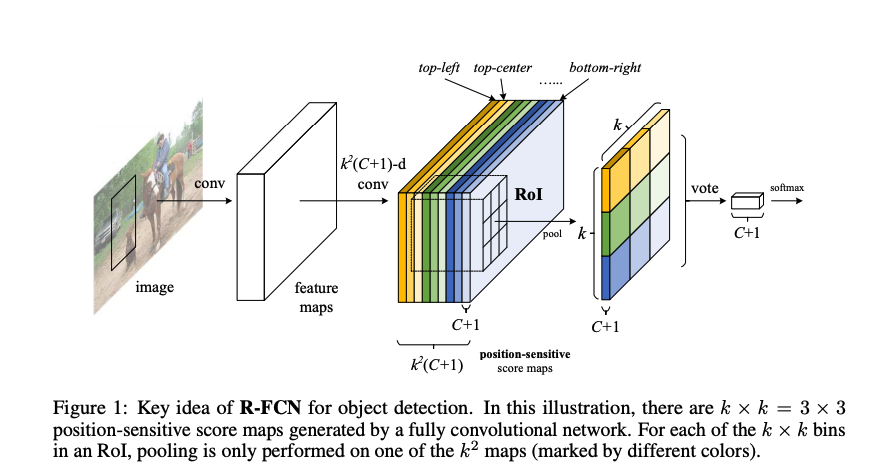

[TOC]

* [ ] hourglass
* [ ] cornerNet
* [ ] centerNet
* [x] fcos
* [ ] retinaNet
* [ ] Objects as Points
* [ ] Sparse R-CNN https://arxiv.org/pdf/2011.12450.pdf
* [ ] yolox
* [ ] 

# 基于关键点的Anchor Free目标检测算法

https://zgcr.gitlab.io/2019/05/31/ji-yu-guan-jian-dian-de-anchor-free-mu-biao-jian-ce-suan-fa-cornernet-cornernet-lite-liang-chong-centernet-fcos-yuan-li/

>   **但anchor boxes的使用有两个缺点:**
>
>   -   首先，我们通常需要非常多的anchor boxes以确保与大多数ground truth充分重叠。 但实际只有一小部分anchor boxes与ground truth重叠，这在正负样本之间造成了巨大的不平衡，同时也减慢了训练速度；
>   -   其次，anchor boxes的使用引入了许多超参数和设计选择。 这些包括多少个box，大小和宽高比。 这些选择主要是通过ad-hoc启发式方法进行的，并且当与多尺度架构相结合时可能会变得更加复杂，其中单个网络在多个分辨率下进行单独预测，每个尺度使用不同的特征和它自己的一组anchor boxes。
>
>   

## Hourglass

讨论：

https://zhuanlan.zhihu.com/p/45002720

paper：

https://arxiv.org/pdf/1603.06937.pdf

## CornerNet

讨论：

https://zhuanlan.zhihu.com/p/41825737

https://discourse.brainpp.cn/t/topic/9011/27

paper：

https://arxiv.org/pdf/1808.01244.pdf

code：

https://github.com/princeton-vl/CornerNet/blob/master/train.py

### Abstract:

*   bbox中心依赖于四个边，很难进行定位，而中心定位角点只需要两条边（？），总的来说是降低了数量级，让任务变得简单。
*   Anchor-free  的优势

### Framework

embedding vector使相同目标的两个顶点（左上角和右下角）距离最短（其实就是配对）， offsets用于调整生成更加紧密的边界定位框。heatmaps 包含 C 个 channels（C是目标的类别，没有background channel）；每个 channel 是二进制 mask，表示相应类别的顶点位置。对于每个顶点，只有一个 ground-truth，其他位置都是负样本。

a）第一个输出是headmaps，也就是预测角点的位置
b）第二个输出是offset：在取整计算时丢失的精度信息
c）第三个输出是embedding：找到一个目标的两个角点

hourglass 很重要，resnet就不行。

### Corner pooling

## CenterNet

论文:CenterNet: Keypoint Triplets for Object Detection
论文地址: https://arxiv.org/pdf/1904.08189.pdf 。
代码地址: https://github.com/Duankaiwen/CenterNet 。

## FCOS

Fullly Convolutional One-Stage Object Detection

https://readpaper.com/pdf-annotate/note?noteId=623694150982402048&pdfId=551693660564176896

code: https://github.com/tianzhi0549/FCOS/

### Introduction：

anchor-based suffer some drawbacks：

1.  sensitive to the size, aspect ratios, number
2.  object of outside anchors, particularly for small objects
3.  densely anchor boxes eg. 180K in FPN for an image with shorter side being 800
4.  involuve complicated computations such as IOU

### Centernss

The center-ness ranges from 0 to 1 and is thus trained with BCE, The loss is added to the loss function. The centerness target is:
$$
\text { centerness }^{*}=\sqrt{\frac{\min \left(l^{*}, r^{*}\right)}{\max \left(l^{*}, r^{*}\right)} \times \frac{\min \left(t^{*}, b^{*}\right)}{\max \left(t^{*}, b^{*}\right)}}
$$

### Ablation study

主要是centerness起作用。

### Details

1.  code 当中 fcos是可以看成rpn的，https://github.com/tianzhi0549/FCOS/blob/0eb8ee0b7114a3ca42ad96cd89e0ac63a205461e/fcos_core/modeling/rpn/rpn.py#L201

    paper中也提到，类比RPN+FPN，FCOS可以替换RPN生成的anchor boxes，效果比原始的rpn要好。

## Yolox

Paper：[https://arxiv.org/abs/2107.08430](https://arxiv.org/abs/2107.08430)

Code：[https://github.com/Megvii-BaseD](https://link.zhihu.com/?target=https%3A//github.com/Megvii-BaseDetection/YOLOX)

Zhihu: https://www.zhihu.com/question/473350307

### Decoupled Head

分类和回归head 提前分开，比较常用

### Data augmentation

Mosaic and Mixup (Strong)

### Anchor free

FCOS liked

### Multi positives·	

high quality predictions 也回传梯度，类似训练时的多峰fp，这种梯度是对模型有帮助的。

### SimOTA: Dynamic label assignment

4 key insights for an advanced label assignment:

1.  loss/quality aware
2.  center prior
3.  dynamic number of positive anchors for each gt
4.  global veiw

# 

## R-FCN   

​						--《R-FCN:Object Detection via Region-based Fully Convolutional Networks》

讨论：https://zhuanlan.zhihu.com/p/30867916

https://blog.csdn.net/baidu_32173921/article/details/71741970

https://blog.csdn.net/wfei101/article/details/79284512

paper：[R-FCN:Object Detection via Region-based Fully Convolutional Networks](https://arxiv.org/pdf/1605.06409.pdf)

### TL;DR

主要贡献在于解决了“**分类网络的位置不敏感性**（translation-invariance in image classification）”与“**检测网络的位置敏感性**（translation-variance in object detection）”之间的矛盾，在提升精度的同时利用“位置敏感得分图（position-sensitive score maps）”提升了检测速度。

### Rethinking

RCNN系列 是在全卷积网络的基础上，利用RPN生成proposal，再ROI Pooling进行分类。 但ROI Pooling 层插入的位置很关键（每个 ROI 候选框对应一次计算，对应 **后面子网的计算量 x N**）：

*   **越靠近 Input - 对应 ROI-Wise 检测子网越深，准确度也就越高；**

*   **越靠近 Output - 对应 ROI-Wise 子网越浅，针对每个 ROI 计算量就越小，效率提高；**

另几篇paper reading 里也提到了这个计算量问题

而ResNet论文中为了解决这样的位置不敏感的缺点，做出了一点让步，即将RoI Pooling Layer不再放置在ResNet-101网络的最后一层卷积层之后而是放置在了“卷积层之间”，这样RoI Pooling Layer之前和之后都有卷积层，并且RoI Pooling Layer之后的卷积层不是**共享**计算的，它们是针对每个RoI进行特征提取的（https://zhuanlan.zhihu.com/p/30867916）

对于region-based的检测方法，以Faster R-CNN为例，实际上是分成了几个subnetwork，第一个用来在整张图上做比较耗时的conv，这些操作与region无关，是计算共享的。第二个subnetwork是用来产生候选的boundingbox（如RPN），第三个subnetwork用来分类或进一步对box进行regression（如Fast RCNN），这个subnetwork和region是有关系的，必须每个region单独跑网络，衔接在这个subnetwork和前两个subnetwork中间的就是ROI pooling。我们希望的是，耗时的卷积都尽量移到前面共享的subnetwork上。因此，和Faster RCNN中用的ResNet（前91层共享，插入ROI pooling，后10层不共享）策略不同，本文把所有的101层都放在了前面**共享**的subnetwork。最后用来prediction的卷积只有1层，大大减少了计算量。（https://blog.csdn.net/baidu_32173921/article/details/71741970）

>    个人理解，产生这个现象的原因是，head相对于backbone计算量大是因为 ROI的数量太多，也就是全量ROI加起来是大于原始的feature map的，因此所谓的 **shared** conv subnetwork（backbone）还是 ROI-wise subnetwork（head）并不关键，主要还是head 数量太多了。

整个框架：没有太多好说的，基本思想就是将conv前移，同时为了避免roi之后只有fc的的糟糕情况（对检测或者说定位不友好）采取了position-sensitive score map，即每个位置都有每个类别每个小部位patch（k*k）的得分，表示“原图image中的哪些位置含有人的某个一个部位”

