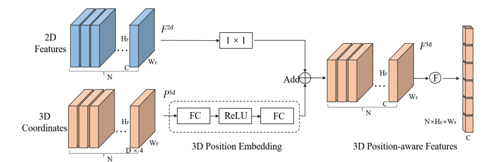

[TOC]

# DETR

## paper reading

https://arxiv.org/pdf/2005.12872.pdf

1. Set Prediction：There is no canonical（权威） deep learning model to directly predict sets. The basic set prediction task is multilabel classification.  The first difficulty in these tasks is to avoid near-duplicates. ***, the loss function should be invariant by a permutation***
2. formulate：
    1. $\hat{\sigma}=\underset{\sigma \in \mathfrak{S}_{N}}{\arg \min } \sum_{i}^{N} \mathcal{L}_{\operatorname{match}}\left(y_{i}, \hat{y}_{\sigma(i)}\right)$
    2. $\mathcal{L}_{\text {Hungarian }}(y, \hat{y})=\sum_{i=1}^{N}\left[-\log \hat{p}_{\hat{\sigma}(i)}\left(c_{i}\right)+\mathbb{1}_{\left\{c_{i} \neq \varnothing\right\}} \mathcal{L}_{\text {box }}\left(b_{i}, \hat{b}_{\hat{\sigma}}(i)\right)\right]$
    3. 第一步通过最小化匹配损失（也就是带权二分图匹配，hungarian算法）得到固定的匹配关系即 $\hat{\sigma}$ ，第二步在通过固定的匹配关系回传梯度。
3. Ablations：
    1. 不加encoder会掉3.9个点，另外可视化效果来看encoder以及可以将instance分隔开
    2. decoder部分，layer较少时，随着layer的增加AP也不断提升，layer的增加也使得网络具备了抑制duplicate预测的能力；另外通过可视化发现decoder部分关注的主要是更加local的特征
    3. FFN的增加能涨2.3个点，其可视为1x1 conv，使encoder与 [Attention Augmented Convolutional Networks](https://discourse.brainpp.cn/t/topic/11192)类似
    4. positional encoding非常重要，全部去掉会掉7.8个点，但只去掉encoder部分的只掉1.3个点
    5. Loss方面， l1 与GIoU结合能达到最好效果

## code理解

先inference一遍计算两个set全量匹配的cost，包括class，boxes，giou等，合理猜测这个cost是n*m的（pred_cnt * gt_cnt），然后调用scipy 的 linear_sum_assignment函数，得到带权二分图匹配最优解 indices。利用indices回传常规的检测loss：

~~~~python
loss_map = {
  'labels': self.loss_labels,
  'cardinality': self.loss_cardinality,
  'boxes': self.loss_boxes,
  'masks': self.loss_masks
} 
~~~~

## Q&A

1.  不太理解的是240L，auxiliary loss 是什么意思？

https://github.com/facebookresearch/detr/blob/master/models/matcher.py

>   训练时候可以加上，但inference的时候可以完全丢掉，（主要指backbone部分不在主干inference路径上）

2.  queries到底有什么用？怎么体现出先验来？decode的时候还有没有mask这个东西？

>   某种位置+类别的先验，见原始paper中，关于queries的可视化结果

3.  Q,K,V在detr里面的shape到底是什么样的？

    ~~~~python
    
    ~~~~

    

# Deformable DETR

However, it (DETR) suffers from slow convergence and limited feature spatial resolution

# DETR3D

paper：https://arxiv.org/pdf/2110.06922.pdf

code：https://github.com/WangYueFt/detr3d

## Framework:

## Method

DETR3D each layer steps： 

1.  predict a set of bounding box centers associated with object queries; 
2.  project these centers into all the feature maps using the camera transformation matrices; 
3.  sample features via bilinear interpolation and incorporate them into object queries; and 
4.  describe object interactions using multi-head attention.

相当于一堆预设的queries（prior）作为输入， 经过一系列的 $\Phi$ (其实就是NN，盲猜fc) 得到一堆坐标点 C，
$$
\boldsymbol{c}_{\ell i}=\Phi^{\mathrm{ref}}\left(\boldsymbol{q}_{\ell i}\right)
$$
通过坐标点C在2d的feature map上获取对应queries的语义信息，在加到原始的queries上（补全feature）
$$
\boldsymbol{f}_{\ell i}=\frac{1}{\sum_{k} \sum_{m} \sigma_{\ell k m i}+\epsilon} \sum_{k} \sum_{m} \boldsymbol{f}_{\ell k m i} \sigma_{\ell k m i} \quad \text { and } \quad \boldsymbol{q}_{(\ell+1) i}=\boldsymbol{f}_{\ell i}+\boldsymbol{q}_{\ell i}
$$
总而言之，就是一堆预设的queries，经过f'c得到一个坐标点，该坐标点通过投影到2d得到对应位置的feature，在加到原始的msa的结果上。就得到了2d+3d的feature

其他就是常规的和detr保持一致的，比如encode，decode，set2set loss等等。

## Q&A

1.  输入queries是固定的话，那么第一层decoder出来的坐标其实也是固定的，这样就强限制了queries对应的2d坐标，这与可视化的分布是不相符的， 是不是有一定的问题，那这样所谓的3d去融合2d的feature并不是位置对应的，那么一个内外参得到的projection是不是没什么用？

    >   所以这就是petr提出来的motivation？

# PETR

paper：https://arxiv.org/pdf/2203.05625v1.pdf

## PETR vs DETR3D

## Method

## Q&A

1.  detr中的position embedding 其实是和HxW拉成一维的feature一一对应的（这才是我理解的PE的意义，在一维中encdoe二维的信息），那这里的3d position embedding并没有和HxW一一对应，该怎么理解呢？

    >   一个解释是，输入的3D Coordinates是通过cam视野过滤之后的一个视锥，将这些坐标点过了两个fc（收敛后的结果可以想象成一个projection），其实是能看成一个3d投影2d的效果（主要是为了获取深度），这样和2D feature 相加就类比增加一个维度的信息。