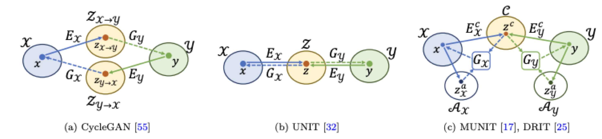

[TOC]

# Image-to-Image Translation

## Problem Definition

- **Basic** **definition of** **I2I:** **converting** **an image from one** **source** **domain to another** **target** **domain**

- **Applications:** **semantic** **image** **synthesis,** **image** **segmentation,** **style** **transfer,** **image** **inpainting** **, 3D** **pose** **estimation,** **image/video colorization,** **image super-resolution, domain** **adaptation,** **cartoon** **generation** **and image** **registration** **…**

## Overview

## pix2pix

* learn translation in a supervised manner using cGAN
* 

## Cycle GAN

孪生三兄弟 CycleGAN，DiscoGAN，DualGAN

https://blog.csdn.net/qq_37995260/article/details/90510052

## Conditional CycleGAN

 

## StarGAN

* Adversarial Loss:    $\begin{aligned}
  \mathcal{L}_{a d v}=& \mathbb{E}_{x}\left[\log D_{s r c}(x)\right]+\
  \mathbb{E}_{x, c}\left[\log \left(1-D_{s r c}(G(x, c))\right)\right]
  \end{aligned}$
* Domain Classification Loss: $\mathcal{L}_{c l s}^{r}=\mathbb{E}_{x, c^{\prime}}\left[-\log D_{c l s}\left(c^{\prime} \mid x\right)\right]$
* Reconstruction Loss:  $\mathcal{L}_{r e c}=\mathbb{E}_{x, c, c^{\prime}}\left[\left\|x-G\left(G(x, c), c^{\prime}\right)\right\|_{1}\right]$
* Full Loss: $\begin{array}{c}
  \mathcal{L}_{D}=-\mathcal{L}_{a d v}+\lambda_{c l s} \mathcal{L}_{c l s}^{r} \\
  \mathcal{L}_{G}=\mathcal{L}_{a d v}+\lambda_{c l s} \mathcal{L}_{c l s}^{f}+\lambda_{r e c} \mathcal{L}_{r e c}
  \end{array}$

## StarGAN v2

* Adversarial objective $\begin{aligned} \mathcal{L}_{a d v}=& \mathbb{E}_{\mathbf{x}, y}\left[\log D_{y}(\mathbf{x})\right]+  \mathbb{E}_{\mathbf{x}, \widetilde{y}, \mathbf{z}}\left[\log \left(1-D_{\widetilde{y}}(G(\mathbf{x}, \widetilde{\mathbf{s}}))\right)\right] \end{aligned}$
* Style reconstruction  $\mathcal{L}_{\text {sty }}=\mathbb{E}_{\mathbf{x}, \widetilde{y}, \mathbf{z}}\left[\left\|\widetilde{\mathbf{s}}-E_{\widetilde{y}}(G(\mathbf{x}, \widetilde{\mathbf{s}}))\right\|_{1}\right]$
* Style diversification $\mathcal{L}_{d s}=\mathbb{E}_{\mathbf{x}, \tilde{y}, \mathbf{z}_{1}, \mathbf{z}_{2}}\left[\left\|G\left(\mathbf{x}, \widetilde{\mathbf{s}}_{1}\right)-G\left(\mathbf{x}, \widetilde{\mathbf{s}}_{2}\right)\right\|_{1}\right]$
* Preserving source characteristics $\mathcal{L}_{c y c}=\mathbb{E}_{\mathbf{x}, y, \tilde{y}, \mathbf{z}}\left[\|\mathbf{x}-G(G(\mathbf{x}, \widetilde{\mathbf{s}}), \hat{\mathbf{s}})\|_{1}\right]$
* Full objective $\begin{array}{rl}\min _{G, F, E} \max _{D} & \mathcal{L}_{a d v}+\lambda_{s t y} \mathcal{L}_{s t y} \\ & -\lambda_{d s} \mathcal{L}_{d s}+\lambda_{c y c} \mathcal{L}_{c y c}\end{array}$

## UNIT

已知两个domain的边缘分布 $P_{X_{1}}(x_{1}),P_{X_{2}}(x_{2})$，想要得到两个domain转换的联合分布$P_{X_{1},X_{2}}(x_{1},{x_{2}})$

很自然就假设这两个domain共享同一个latent code

共享latent code其实就是 $E_{1}(x_{1}) = z = E_{2}(x_{2})$

综合起来就是本文使用了两个VAE-GAN

## MUNIT

思想就是x1和x2encode两个latent code，交叉后decode两种图片，构建重建loss

## DRIT，DRIT++

和MUNIT 思路基本一样：

pipeline：

 

[image-2-image translation.pptx](../../../../Desktop/image-2-image translation.pptx) 

