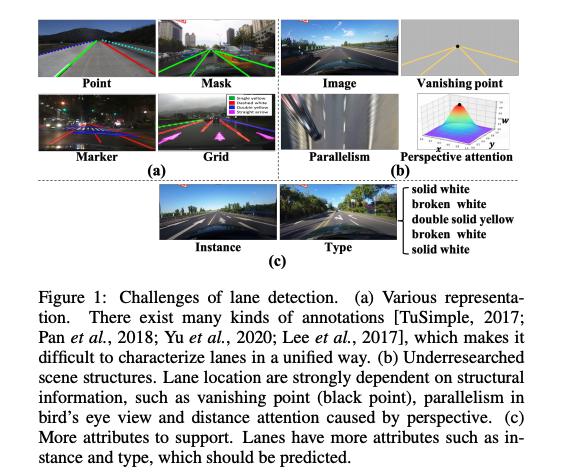

# Reference:

超快的车道线检测 https://zhuanlan.zhihu.com/p/157530787  https://github.com/cfzd/Ultra-Fast-Lane-Detection

近期阅读的几篇关于车道线检测的论文总结。https://www.cnblogs.com/lylec/p/13787589.html

车道线检测综述及近期新工作2021 https://zhuanlan.zhihu.com/p/376322147

Paper List

<pre>
## 2021:
1. Structure Guided Lane Detection IJCAI 2021 美团
2. CondLaneNet: a Top-to-down Lane Detection Framework Based on Conditional Convolution
3. Keep your Eyes on the Lane: Real-time Attention-guided Lane Detection CVPR 2021 代码开源
4. YOLinO: Generic Single Shot Polyline Detection in Real Time
5. LaneAF: Robust Multi-Lane Detection with Affinity Fields 代码开源
6. Robust Lane Detection via Expanded Self Attention
7. End-to-End Deep Learning of Lane Detection and Path Prediction for Real-Time Autonomous Driving
8. RESA: Recurrent Feature-Shift Aggregator for Lane Detection AAAI 2021 代码开源
9. End-to-end Lane Shape Prediction with Transformers WACV 2021 代码开源
## 2020:
1. 3D-LaneNet+: Anchor Free Lane Detection using a Semi-Local Representation
2. Keep your Eyes on the Lane: Attention-guided Lane Detection 代码开源
3. RONELD: Robust Neural Network Output Enhancement for Active Lane Detection ICPR 2020 代码开源
4. CurveLane-NAS: Unifying Lane-Sensitive Architecture Search and Adaptive Point Blending ECCV 2020 Datasets
5. Towards Lightweight Lane Detection by Optimizing Spatial Embedding ECCV 2020 Workshop
6. Structure-Aware Network for Lane Marker Extraction with Dynamic Vision Sensor
7. Lane Detection Model Based on Spatio-Temporal Network with Double ConvGRUs
8. Heatmap-based Vanishing Point boosts Lane Detection
9. Synthetic-to-Real Domain Adaptation for Lane Detection
10. E2E-LMD: End-to-End Lane Marker Detection via Row-wise Classification
11. SUPER: A Novel Lane Detection System
12. Ultra Fast Structure-aware Deep Lane Detection ECCV 2020 代码开源
13. PolyLaneNet: Lane Estimation via Deep Polynomial Regression 代码开源
14. Inter-Region Affinity Distillation for Road Marking Segmentation CVPR 2020 代码开源
15. Gen-LaneNet: A Generalized and Scalable Approach for 3D Lane Detection ECCV 2020 代码开源
16. Detecting Lane and Road Markings at A Distance with Perspective Transformer Layers
17. Semi-Local 3D Lane Detection and Uncertainty Estimation
18. FusionLane: Multi-Sensor Fusion for Lane Marking Semantic Segmentation Using Deep Neural Networks 代码开源
19. PINet：Key Points Estimation and Point Instance Segmentation Approach for Lane Detection 代码开源
20. Better-CycleGAN + ERFNet: Lane Detection in Low-light Conditions Using an Efficient Data Enhancement : Light Conditions Style Transfer submitted to IV 2020
21. Multi-lane Detection Using Instance Segmentation and Attentive Voting ICCAS 2019
</pre>

#### cvpr 2021：

**Focus on Local: Detecting Lane Marker from Bottom Up via Key Point（FOLO）**

-   Paper: https://arxiv.org/abs/2105.13680
-   Code: None

**Keep your Eyes on the Lane: Real-time Attention-guided Lane Detection (LaneATT)**

-   Paper: https://arxiv.org/abs/2010.12035
-   Code: https://github.com/lucastabelini/LaneATT

#### WACV 2021:

**End-to-end Lane Shape Prediction with Transformers (LSTR)**

*   论文地址：https://arxiv.org/pdf/2011.04233.pdf
*   Github地址：https://github.com/liuruijin17/LSTR

#### arxiv :

Preprocessing Methods of Lane Detection and Tracking for Autonomous Driving :

*   https://arxiv.org/pdf/2104.04755.pdf

CondLaneNet: a Top-to-down Lane Detection Framework Based on Conditional

*   https://arxiv.org/pdf/2105.05003.pdf

Structure Guided Lane Detection

*   https://arxiv.org/pdf/2105.05403.pdf

SEMI-SUPERVISED LANE DETECTION WITH DEEP HOUGH TRANSFORM

*   https://arxiv.org/pdf/2106.05094.pdf

#### Perception (SLAM):

**Pseudo-LiDAR from Visual Depth Estimation: Bridging the Gap in 3D Object Detection for Autonomous Driving**

*   https://arxiv.org/pdf/1812.07179.pdf

*   https://zhuanlan.zhihu.com/p/52803631

**Pseudo-LiDAR++: Accurate Depth for 3D Object Detection in Autonomous Driving**

*   https://arxiv.org/pdf/1906.06310.pdf
*   https://github.com/mileyan/Pseudo_Lidar_V2

#### reference

*   SCNN
*   

# Video-ppt Studying

 [Lane Detection.pdf](../material/asserts/Lane Detection.pdf) 

Segmentation-based

Q: 基于分割的，为什么每个类别都需要一个channel，做2分类，而不是所有类别放在一起做多分类？

Q: existence head 干吗用的？

Q: 什么是offset map？

# Structure Guided Lane Detection

*   IJCAI 2021美团提出车道线检测新框架SGNet https://www.jiqizhixin.com/articles/2021-05-16-2

*   https://arxiv.org/pdf/2105.05403.pdf

### TL;DR

​    ***a structure guided framework  , and propose a topdown vanishing point guided anchoring mechanism***

### 3 problem:

*   characterizing lanes: there lacks a unified and effective lane representation.

*   modeling the structural relationship between scenes and lanes, 

*   supporting more attributes, other attributes including instance and type

### Solution

*   box-line based proposal method
*   multi-level structure：pixel-level，improve lane detials； lane-level relation，modeling parallelism properties of inter-lanes

