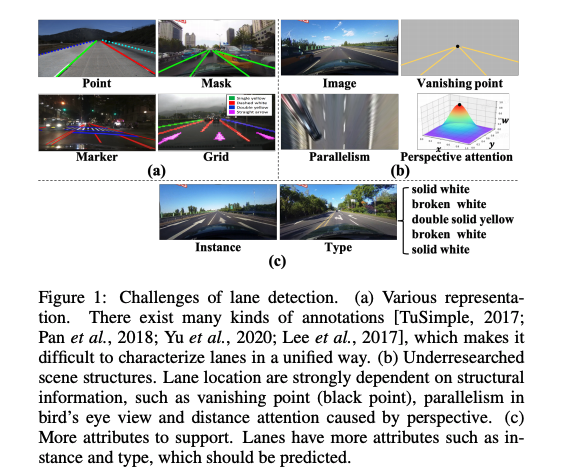

[TOC]

# Reference:

超快的车道线检测 https://zhuanlan.zhihu.com/p/157530787  https://github.com/cfzd/Ultra-Fast-Lane-Detection

近期阅读的几篇关于车道线检测的论文总结。https://www.cnblogs.com/lylec/p/13787589.html

车道线检测综述及近期新工作2021 https://zhuanlan.zhihu.com/p/376322147

lane detection leadboard https://paperswithcode.com/task/lane-detection

知乎paper reading https://zhuanlan.zhihu.com/p/103801993

​								https://zhuanlan.zhihu.com/p/361990601

## Paper List

Paper List

<pre>
## 2021:
1. Structure Guided Lane Detection IJCAI 2021 美团
2. CondLaneNet: a Top-to-down Lane Detection Framework Based on Conditional Convolution
3. Keep your Eyes on the Lane: Real-time Attention-guided Lane Detection CVPR 2021 代码开源
4. YOLinO: Generic Single Shot Polyline Detection in Real Time
5. LaneAF: Robust Multi-Lane Detection with Affinity Fields 代码开源
6. Robust Lane Detection via Expanded Self Attention
7. End-to-End Deep Learning of Lane Detection and Path Prediction for Real-Time Autonomous Driving
8. RESA: Recurrent Feature-Shift Aggregator for Lane Detection AAAI 2021 代码开源
9. End-to-end Lane Shape Prediction with Transformers WACV 2021 代码开源
## 2020:
1. 3D-LaneNet+: Anchor Free Lane Detection using a Semi-Local Representation
2. Keep your Eyes on the Lane: Attention-guided Lane Detection 代码开源
3. RONELD: Robust Neural Network Output Enhancement for Active Lane Detection ICPR 2020 代码开源
4. CurveLane-NAS: Unifying Lane-Sensitive Architecture Search and Adaptive Point Blending ECCV 2020 Datasets
5. Towards Lightweight Lane Detection by Optimizing Spatial Embedding ECCV 2020 Workshop
6. Structure-Aware Network for Lane Marker Extraction with Dynamic Vision Sensor
7. Lane Detection Model Based on Spatio-Temporal Network with Double ConvGRUs
8. Heatmap-based Vanishing Point boosts Lane Detection
9. Synthetic-to-Real Domain Adaptation for Lane Detection
10. E2E-LMD: End-to-End Lane Marker Detection via Row-wise Classification
11. SUPER: A Novel Lane Detection System
12. Ultra Fast Structure-aware Deep Lane Detection ECCV 2020 代码开源
13. PolyLaneNet: Lane Estimation via Deep Polynomial Regression 代码开源
14. Inter-Region Affinity Distillation for Road Marking Segmentation CVPR 2020 代码开源
15. Gen-LaneNet: A Generalized and Scalable Approach for 3D Lane Detection ECCV 2020 代码开源
16. Detecting Lane and Road Markings at A Distance with Perspective Transformer Layers
17. Semi-Local 3D Lane Detection and Uncertainty Estimation
18. FusionLane: Multi-Sensor Fusion for Lane Marking Semantic Segmentation Using Deep Neural Networks 代码开源
19. PINet：Key Points Estimation and Point Instance Segmentation Approach for Lane Detection 代码开源
20. Better-CycleGAN + ERFNet: Lane Detection in Low-light Conditions Using an Efficient Data Enhancement : Light Conditions Style Transfer submitted to IV 2020
21. Multi-lane Detection Using Instance Segmentation and Attentive Voting ICCAS 2019
</pre>

### cvpr 2021：

**Focus on Local: Detecting Lane Marker from Bottom Up via Key Point（FOLO）**

-   Paper: https://arxiv.org/abs/2105.13680
-   Code: None

**Keep your Eyes on the Lane: Real-time Attention-guided Lane Detection (LaneATT)**

-   Paper: https://arxiv.org/abs/2010.12035
-   Code: https://github.com/lucastabelini/LaneATT

### WACV 2021:

**End-to-end Lane Shape Prediction with Transformers (LSTR)**

*   论文地址：https://arxiv.org/pdf/2011.04233.pdf
*   Github地址：https://github.com/liuruijin17/LSTR

### arxiv :

**Preprocessing Methods of Lane Detection and Tracking for Autonomous Driving :**

*   https://arxiv.org/pdf/2104.04755.pdf

**CondLaneNet: a Top-to-down Lane Detection Framework Based on Conditional**

*   https://arxiv.org/pdf/2105.05003.pdf

**Structure Guided Lane Detection**

*   https://arxiv.org/pdf/2105.05403.pdf

**SEMI-SUPERVISED LANE DETECTION WITH DEEP HOUGH TRANSFORM**

*   https://arxiv.org/pdf/2106.05094.pdf

**A Robust Lane Detection Associated with Quaternion Hardy Filter**

*   https://arxiv.org/pdf/2108.04356.pdf

**ContinuityLearner: Geometric Continuity Feature Learning for Lane Segmentation**

*   https://arxiv.org/pdf/2108.03507.pdf

**Lane Graph Estimation for Scene Understanding in Urban Driving**

*   https://arxiv.org/pdf/2105.00195.pdf

Lane detection and classi- fication using cascaded cnns.

*   https://arxiv.org/pdf/1907.01294.pdf

### Perception (SLAM):

**Pseudo-LiDAR from Visual Depth Estimation: Bridging the Gap in 3D Object Detection for Autonomous Driving**

*   https://arxiv.org/pdf/1812.07179.pdf

*   https://zhuanlan.zhihu.com/p/52803631

**Pseudo-LiDAR++: Accurate Depth for 3D Object Detection in Autonomous Driving**

*   https://arxiv.org/pdf/1906.06310.pdf
*   https://github.com/mileyan/Pseudo_Lidar_V2

### reference

*   SCNN
    *   https://arxiv.org/pdf/1712.06080.pdf
    *   https://github.com/AlbertFeng-0405/SCNN
*   VGPNet
*   Line-CNN
*   End-to-end lane detection through differen- tiable least-squares fitting

| Method            | Title                                                    | Public                                                       | Code                                                         |
| ----------------- | -------------------------------------------------------- | ------------------------------------------------------------ | ------------------------------------------------------------ |
| Anchor-based      | SGNet                                                    | IJCAI 2021 美团                                              | -                                                            |
|                   | LaneATT                                                  | CVPR 2021                                                    | https://github.com/lucastabelini/LaneATT                     |
|                   | Curvelane-nas                                            | ECCV2020 华为                                                | https://github.com/huawei-noah/vega                          |
|                   | Line-CNN                                                 | TITS2019                                                     |                                                              |
|                   |                                                          |                                                              |                                                              |
| Seg-based         | RESA                                                     | AAAI2021 浙大                                                | https://github.com/ZJULearning/resa                          |
|                   | LaneAF                                                   | 2021 UCSD                                                    | https://github.com/sel118/LaneAF                             |
|                   | SCNN                                                     | AAAI 2018 商汤                                               | https://github.com/XingangPan/SCNN                           |
|                   |                                                          |                                                              |                                                              |
| Row-wise          | UFAST                                                    | ECCV 2020                                                    | https://github.com/cfzd/Ultra-Fast-Lane-Detection            |
|                   | E2E-LMD                                                  |                                                              | https://github.com/Vipermdl/E2E-ERFNet                       |
|                   | CondLaneNet                                              | 2021 阿里                                                    | https://github.com/aliyun/conditional-lane-detection         |
|                   | FOLOLane                                                 | CVPR 2021 华为                                               | -                                                            |
|                   |                                                          |                                                              |                                                              |
| Parametric        | LSTR                                                     | WACV 2021 西交                                               | https://github.com/liuruijin17/LSTR                          |
|                   | PolyLaneNet                                              | ICPR 2020                                                    | https://github.com/lucastabelini/PolyLaneNet                 |
| 3d Lane Detection | 3D-LaneNet                                               | ICCV 2019                                                    | https://github.com/yuliangguo/Pytorch_Generalized_3D_Lane_Detection（unofficial） |
|                   | 3D-LaneNet+                                              | NIPS workshop 2020                                           | -                                                            |
|                   | Gen-LaneNet                                              | ECCV 2020                                                    | https://github.com/yuliangguo/Pytorch_Generalized_3D_Lane_Detection |
| other             | LaneDet                                                  | 工具 浙大                                                    | https://github.com/Turoad/lanedet                            |
|                   |                                                          |                                                              |                                                              |
| unorganized       | VPGNet                                                   | ICCV 2017                                                    | https://github.com/SeokjuLee/VPGNet                          |
|                   |                                                          |                                                              |                                                              |
| Not recommended   | Lane detection and classi- fication using cascaded cnns. | In *International Conference on Computer Aided Systems Theory*, 2019. | https://github.com/fabvio/Cascade-LD.                        |

Questions：

1.  row-wise没有考虑线宽，这是否是一个点？seg-based的不太清楚是否有标注，需要看一下数据集。
2.  数据集里面的FOV是否保持一致？如果大部分一致（或者有外参），这个是否可以作为prior利用上？
3.  个人猜测row-wise的主要优点是有geography的loss，（连续二阶导为零）
    1.  一个问题，透射变化那之后还满足一些数学规律吗？
4.  BEV问题，需要端到端的优化吗？比如利用平行或者等间距的先验（当前loss似乎没有lanes间的loss）
5.  车道线 type 

# Video-ppt Studying

 [Lane Detection.pdf](../../material/asserts/Lane Detection.pdf) 

Q: 基于分割的，channel 上需要每个都出一个logit吗，是多分类还是多个二分类？

>   是一个多分类，一般不会是多个二分类

Q: existence head 干吗用的？

Q: 什么是offset map？

>   与anchor的offset 或者 与 Line（通常是建模简化的线） 的 offset， 也有是对格子的offset（condLane）

Q: row-wise不同数量的车道线怎么处理？

>   Ufast 并不能处理，只能给出先验的上限5， condLanenet 可以自动的给出数量。

Q: anchor长啥样？

>   performs anchorbased detection using *lines* instead of boxes

Q: 是不是key points 也算一类方法？

>   FoloLane 里面确实是先得到key points然后再约束上下行（采样后的行）点，再根据贪心连起来的。但目前归于Row-wise的方法。

# Structure Guided Lane Detection（SGNet）

*   IJCAI 2021美团提出车道线检测新框架SGNet https://www.jiqizhixin.com/articles/2021-05-16-2

*   https://arxiv.org/pdf/2105.05403.pdf

## TL;DR

​    ***a structure guided framework  , and propose a topdown vanishing point guided anchoring mechanism***

## 3 problem:

*   characterizing lanes: there lacks a unified and effective lane representation.

*   modeling the structural relationship between scenes and lanes, 

*   supporting more attributes, other attributes including instance and type

    车道线检测存在的挑战：(a)多种多样的车道线表示方式；(b)车道线相关的结构信息；(c)车道线的多种属性。

    

## Solution

*   box-line based proposal method
*   multi-level structure：pixel-level，improve lane detials； lane-level relation，modeling parallelism properties of inter-lanes

### Lane Representation

形式和LaneATT里面的Anchor是一样的，只不过LaneATT label形式还是点（输出靠Anchor+offset来确定），而SGNet的标签就改成了确定的Line+offset

### VP-based Anchor

### Variable Loss

1.  **Anchor estimation：**

     $\mathcal{L}_{\mathcal{V}}=B C E\left(\phi_{\mathcal{V}}\left(\pi_{\mathcal{V}}\right), G_{\mathcal{V}}\right)$

2.  **Classification and Regression：**

     $\begin{aligned} \mathcal{L}_{\mathcal{C}} &=\sum_{L_{\text {lane }}=0}^{L-1} B C E\left(\text { Conf }^{L_{\text {lane }}}, G C o n f^{L_{\text {lane }}}\right) \\ \mathcal{L}_{\mathcal{R}} &=\sum_{L_{\text {lane }}=0}^{L-1} S L 1\left(\Delta X^{L_{\text {lane }}}, G \Delta X^{L_{\text {lane }}}\right) \end{aligned}$

3.  Pixel-level Perception：

    $\mathcal{L}_{\mathcal{P}}=B C E\left(\mathrm{P}_{\mathcal{P}}, G_{\mathcal{P}}\right)$

1.  Lane-level Relation，乘上一个转换矩阵（learned H matrix）后保证平行。

    $a_{1} * x+b_{1} * y+c_{1}=0$,
    $a_{2} * x+b_{2} * y+c_{2}=0$

    $L_{\mathcal{L}}=\sum_{i=0, j=0, i \neq j} L 1\left(a_{i} b_{j}-a_{j} b_{i}\right)$

2.  Image-level Attention：

    $\begin{aligned} L_{\mathcal{I}}=& \sum_{L_{\text {lane }}=0}^{L-1} \sum_{p=0}^{P-1} L 1\left(\Delta x_{p}^{ \left.L_{\text {lane }}, G \Delta x_{p}^{L_{\text {lane }}}\right)}\right.\\ & \cdot\left(1+\left|E\left(x_{p}^{L_{\text {lane }}}, y_{p}^{L_{\text {lane }}}\right)\right|\right) \end{aligned}$

3.  Total loss： $\min _{\mathbb{P}} \mathcal{L}_{\mathcal{V}}+\mathcal{L}_{\mathcal{C}}+\mathcal{L}_{\mathcal{R}}+\mathcal{L}_{\mathcal{P}}+\mathcal{L}_{\mathcal{L}}+\mathcal{L}_{\mathcal{I}}$

### Metrics

F1-measure,  treat each lane as a line with 30 pixel width and compute the IOU

## Conclusion

VP-based Anchor，lane-level relation，pixel-level perception，Image-level Attention

# Robust Multi-Lane Detection with Affinity Fields(LaneAF)

# Keep your Eyes on the Lane: Real-time Attention-guided Lane Detection (LaneATT)

paper：https://arxiv.org/pdf/2010.12035.pdf

code：https://github.com/lucastabelini/LaneATT

reference： https://video-discourse.iap.wh-a.brainpp.cn/t/topic/7241

​		https://blog.csdn.net/weixin_43726913/article/details/116974705

​		https://blog.csdn.net/weixin_42096202/article/details/109939763

## TL;DR

***LaneATT: an anchor-based single-stage deep lane detection model***

## PPL

## Anchor-based feature pooling

Since the anchors are modeled as lines, the interest points for a given anchor are those that intercept the anchor’s virtual line

the RoI pooling layer (used to generate fixed-size features) is not necessary for our method.

理解起来，feature pooling就是线采样，直接得到一个feature vector。而这样就不需要所谓的RO pooling了，因为是等宽的（width = 1），长度只需要截断就行了。（具体的需要看代码）>> 更正，长度并没有截断，而是取完整的h 【[link](https://github.com/lucastabelini/LaneATT/blob/2f8583ba14eccba05e6779668bc3a38bc751984a/lib/models/laneatt.py#L235)】

## Conclusion

感觉起来就是传统的检测方法，套在了lane detection上，不同的是object 从boxes 变成了lines，所以相应的pooling也变成了线采样+截断。其他anchor的生成，backbone，以及nms都没有什么区别。额外的attention也挺有意思的，是feature vector之间的correlation。

# Ultra Fast Structure-aware Deep Lane Detection(UFAST)

paper：https://arxiv.org/pdf/2004.11757.pdf

code：https://github.com/cfzd/Ultra-Fast-Lane-Detection

# Focus on Local: Detecting Lane Marker from Bottom Up via Key Point

paper：https://arxiv.org/pdf/2105.13680.pdf

code：无

## TL;DR

***FOLO: A bottom-up seg-based and row-wise lane detection method. Contrast to CondLane, takes semantic segmentation(or said to detects key points) first and then cluster them as instance***.

## Methodology

### Key point estimation (Heatmap)

一个小trick，gt的生成也是利用gaussian kernel，区别是这里中心全部是1，边缘满足高斯。

>   个人理解：所谓的key point estimation 和 binary semantic segmentation 的区别只是任务上的区别，形式上是一样的。segmentation一般来说比较连续，key point相对离散，二者都是单通道的HxW大小的output ，和gt做loss（一般都是BCE）

### Local geometry construction (Offset)

### Loss

$$
\text { Loss }=\text { Loss }_{h}+\lambda\left(\text { Loss }_{\uparrow}+\text { Loss }_{\downarrow}+\text { Loss }_{\rightarrow}\right)
$$

### Decoder for global geometry

所谓的decoder 目的就是将heatmap上的key points 连起来，最naive的就是从最近处的一行开始，每次找下一行的 $\Delta x$和$\Delta y$    确定当前instance的下一个点，但显然这样成功率会比较低，且并没有很好利用 $-\Delta y$ 的信息。文中有一些greedy algorithm来解决这件事情。

# CondLaneNet:a Top-to-down Lane Detection Framework Based on Conditional Convolution

paper：https://arxiv.org/pdf/2105.05003.pdf

code：https://github.com/aliyun/conditional-lane-detection

reference：https://zhuanlan.zhihu.com/p/393167538

​		https://video-discourse.iap.wh-a.brainpp.cn/t/topic/7216

## TL;DR

***a novel top-to-down lane detection framework that detects the lane instances first and then dynamically predicts the line shape for each instance.***

## Question：

1.  offset 是啥，和$E(x_{i})$ 的区别是啥？
2.  shape description 

## Structure

## Shape description

1.  Row-wise Location 

    $p_{i} = softmax(f_{loc}^i)$

    $E\left(\hat{x}_{i}\right)=\sum_{j} j \cdot p_{i j}$

    L1-loss is applied: $\ell_{\text {row }}=\frac{1}{N_{v}} \sum_{i \in V}\left|E\left(\hat{x}_{i}\right)-x_{i}\right|$

    >   一个smooth max的操作，将分类问题转化成一个回归的结果，$E(\hat x_{i})$ 是预测的坐标（格子级别的），和gt算一个L1 loss

2.  Vertical Range

    

    $\ell_{\text {range }}= \sum_{i}(-y^i_{gt}log(v_{i}) - (1-y^i_{gt})log(1-v_{i}))$

    >   每一行都算一个BCE loss，但并没有考虑行间的连续。

3.  Offset Map

    $\ell_{\text {offset }}=\frac{1}{N_{\Omega}} \sum_{j,i \in \Omega}\left|\hat\delta_{ij} - \delta_{ij}\right|$`

    其中，$\delta$  是每个点对应自己的offset，目的是修正$E\left(\hat{x}_{i}\right)$ 得到的坐标，$ij$ 是坐标， $\Omega$ 是 area near the lane with fixed width.

4.  Shape Description

    $\left\{\begin{array}{l}y_{k}^{i}=H / Y \cdot i \\ x_{k}^{i}=W / X \cdot\left(l o c_{k}^{i}+\delta\left(\operatorname{loc}_{k}^{i}, i\right)\right)\end{array}\right.$
    
    $\operatorname{loc}_{k}^{i}$ 是$E\left(\hat{x}_{i}\right)$ 去round之后的值，该点坐标加上对应的offset就是最终横坐标的值。

# VPGNet: Vanishing Point Guided Network for Lane and Road Marking Detection and Recognition

