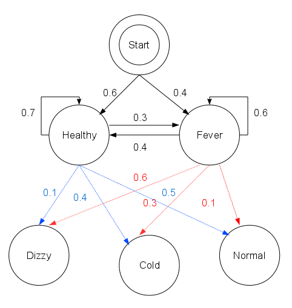

# Viterbi算法

wiki：https://zh.wikipedia.org/zh-hans/%E7%BB%B4%E7%89%B9%E6%AF%94%E7%AE%97%E6%B3%95


```python
states = ('Healthy', 'Fever')
 
observations = ('normal', 'cold', 'dizzy')
 
start_probability = {'Healthy': 0.6, 'Fever': 0.4}
 
transition_probability = {
   'Healthy' : {'Healthy': 0.7, 'Fever': 0.3},
   'Fever' : {'Healthy': 0.4, 'Fever': 0.6},
   }
 
emission_probability = {
   'Healthy' : {'normal': 0.5, 'cold': 0.4, 'dizzy': 0.1},
   'Fever' : {'normal': 0.1, 'cold': 0.3, 'dizzy': 0.6},
   }
```
在这段代码中, 起始概率`start_probability` 表示病人第一次到访时医生认为其所处的HMM状态，他唯一知道的是病人倾向于是健康的。这里用到的特定概率分布不是均衡的,如转移概率大约是`{'Healthy': 0.57, 'Fever': 0.43}`。 转移概率`transition_probability`表示潜在的马尔可夫链中健康状态的变化。在这个例子中，当天健康的病人仅有30%的机会第二天会发烧。放射概率`emission_probability`表示每天病人感觉的可能性。假如他是健康的，50%会感觉正常。如果他发烧了，有60%的可能感觉到头晕。





```python
# Helps visualize the steps of Viterbi.
def print_dptable(V):
    print("    ")
    for i in range(len(V)): 
        print("%7d" % i)
    print

    for y in V[0].keys():
        print("%.5s: " % y)
        for t in range(len(V)):
            print("%.7s" % ("%f" % V[t][y]))
        print

def viterbi(obs, states, start_p, trans_p, emit_p):
    V = [{}]
    path = {}

    # Initialize base cases (t == 0)
    for y in states:
        V[0][y] = start_p[y] * emit_p[y][obs[0]]
        path[y] = [y]

    # Run Viterbi for t > 0
    for t in range(1,len(obs)):
        V.append({})
        newpath = {}

        for y in states:
            (prob, state) = max([(V[t-1][y0] * trans_p[y0][y] * emit_p[y][obs[t]], y0) for y0 in states])
            V[t][y] = prob
            newpath[y] = path[state] + [y]

        # Don't need to remember the old paths
        path = newpath

    print_dptable(V)
    (prob, state) = max([(V[len(obs) - 1][y], y) for y in states])
    return (prob, path[state])
```

```python
def example():
    return viterbi(observations,
                   states,
                   start_probability,
                   transition_probability,
                   emission_probability)
print(example())
```

维特比算法揭示了观察结果 `['normal', 'cold', 'dizzy']` 最有可能由状态序列 `['Healthy', 'Healthy', 'Fever']`产生。 换句话说，对于观察到的活动, 病人第一天感到正常，第二天感到冷时都是健康的，而第三天发烧了。

维特比算法的计算过程可以直观地由[格图](https://zh.wikipedia.org/wiki/卷积码)表示。 维特比路径本质上是穿过格式结构的最长路径。 诊所例子的格式结构如下, 黑色加粗的是维特比路径：


