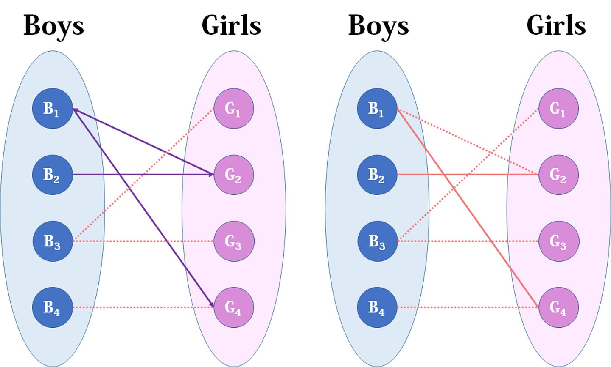

https://zhuanlan.zhihu.com/p/96229700

遍历左边，每次循环能保证确定当前$B_{i}$ 是否能匹配到，如果返回True，cnt++，否则跳过。

~~~~python
def hungarian(self, A: List[List[int]]) -> int:
    M,N = len(A),len(A[0])
    match = [-1]*N
    def search(i):
        for j in range(N):
            if vis[j]==False and A[i][j]:
                vis[j] = True
                if match[j] == -1 or search(match[j]):
                    match[j] = i
                    return True
        return False
    cnt = 0
    for i in range(M):
        vis = [False]*N
        if search(i):
            cnt+=1
        print(match)
    return cnt
~~~~

## Question：

detr里面是怎么求导的呢？

Answer: 先定义loss，用hungarian 得到在此loss顶一下，最小代价的匹配关系（matcher），然后固定这个映射关系，将梯度回传。