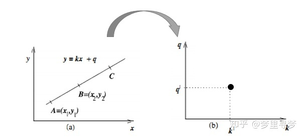
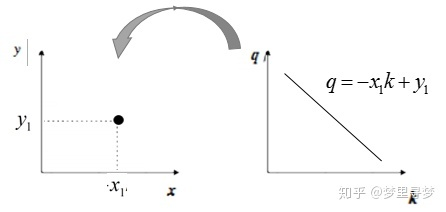
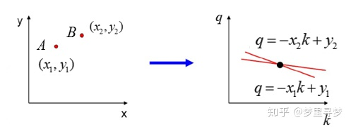
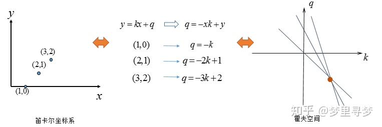
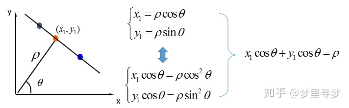
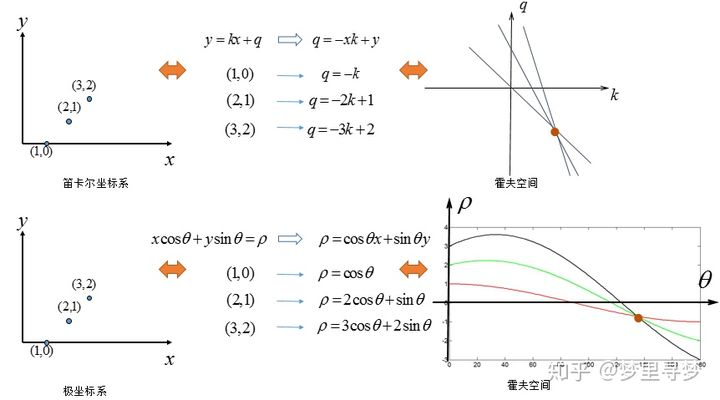
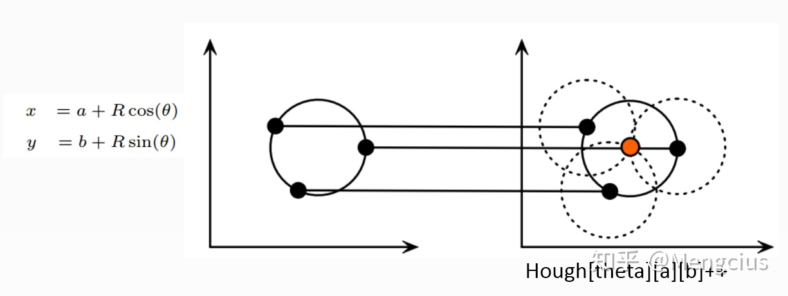

# 霍夫变换

霍夫变换就是将原始空间转化成参数空间，一般将原始笛卡尔坐标转化成参数坐标，能够方便的做直线检测

## 霍夫直线检测

Reference ：https://zhuanlan.zhihu.com/p/203292567

### 参数空间

原始空间的一条直线：$y = ax +b$ ， 对应参数空间：$(a,b)$ 一个固定的点 。

反过来，原始空间的一个点 $(x_{0},y_{0})$，对应参数空间一条直线 $b = -ax_{0} + y_{0}$（参数空间每个点代表原始空间一条直线，参数空间直线表示所有在原始空间过该点的直线的集合）

   

同理，两个点和三个点的情况：

   

### 极坐标参数空间

但 $(a,b)$ 无法解决斜率为正无穷的情况，这样霍夫空间直线会平行，相交于无穷远。为了解决这种情况，利用 $(\rho, \theta)$ 来替换$(a,b)$

>    注意图上公式写错了，应该是 $ x_{1}cos\theta + y_{1}sin\theta = \rho$ 

同理，原始空间上直线$ xcos\theta_{0} + ysin\theta_{0} = \rho_{0}$  对应参数空间 $(\theta_{0}, \rho_{0})$ 一个点。反过来，对于每个原始空间的坐标 $(x_{1}, y_{1})$ 都对应参数空间一个曲线 $ x_{1}cos\theta + y_{1}sin\theta = \rho$ 

>   另外，知乎链接里面有个地方写错了，不是 极坐标的点 -> 霍夫空间的直线。 而应该是原始空间的点 -> 极坐标参数的霍夫空间的曲线 

## 霍夫圆检测

同理，只不过是将参数由两个变成三个。 对于圆来说，我们需要三个参数：圆心（a，b），半径 r。

对于（x0，y0），我们可以将通过这一点的所有圆统一定义为：

$a = x_{0} - r·cosθ$

$b = y_{0} - r·sinθ$

这就意味着每一组（a，b，r）代表一个通过点（x0,y0）的圆。 我们可以在三维直角坐标系中，绘出所有通过它的圆。最终我们将得到一条三维的曲线。

