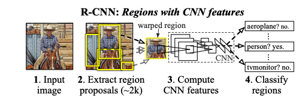

[TOC]

# Object Detection with Deep Learning: A Review

paper link: <https://arxiv.org/pdf/1807.05511.pdf>

## key words

1. selective search
2. nms
3.  

## knowledge point

#### R-CNN:

​	Region proposal generation -> CNN based extract feature -> Classification and localization

#### SPP-net:

​	A spatial pyramid pooling layer :  project a feature map to a fixed-length vector。feature length: 256x(1^2+2^2+4^2)

#### Fast R-CNN:

