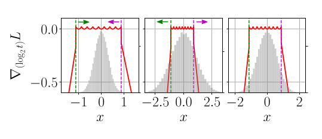

1. calibration set 对w的scale有没有影响
2. loss的梯度 为什么全是正的，默认是l2 loss的梯度
   
3. 


~~~~python
def quantize(x, L=127):
    old_name_suffix=x.name.split(':')[-1]
    new_name_suffix=re.sub(r'\d+','',old_name_suffix)
    new_name=':'.join(x.name.split(':')[:-1])+':'+new_name_suffix
    x.rename(new_name)
    
    name = x.name
    s_value = ParamProvider(name + ':s_value', initializer=[-5])
    s = SetGrad(s_value, None)
    s.rename(name + ':s_param')
    t = Pow(2, s)
    t.rename(name + ':scale')
    x = SetGrad(x, None)
    
    x_scaled = x / t
    x_scaled.rename(name + ':scaled')
    x_clipped = clip(x_scaled, -L-1, L)
    x_clipped.rename(name + ':clipped')
    x_rounded = Round(x_clipped).astype('int8')
    x_rounded.rename(name + ':rounded')
    x_flq = x_rounded * t
    x_flq.rename(name + ':flq')

    grad_x_flq = GradWrt(x_flq)
    mask_clip = (x_scaled < -1.5 - L) + (x_scaled > L + 0.5)
    mask_quant = Abs(mask_clip - 1)
    grad_quant = grad_x_flq * mask_quant * (x_rounded - x_scaled)
    grad_clip = grad_x_flq * mask_clip * x_rounded
    grad_s = grad_quant.sum() + grad_clip.sum()
    grad_s = grad_s * t * 0.7
    s.set_grad_var(grad_s)
    grad_x = grad_x_flq * mask_quant
    x.set_grad_var(grad_x)

    x = x_flq
    return x

~~~~

```python
def mimic_hisi(x, delta=0.0625):
    x = np.float64(x)
    shp = x.shape # store shape
    x = x.flatten()
    x_abs = np.abs(x)
    x_log2 = np.log2(x_abs) # be aware of 0 -> -inf
    x_sign = np.sign(x)
    x_abs_max = np.max(x_log2)
    max_bound = np.floor(x_abs_max/delta)  # clip towards zero
    min_bound = max_bound - 127 
    clip = np.clip(np.round(x_log2/delta), min_bound, max_bound) 
    modify_mask0 = np.logical_and(x_sign == -1, clip == min_bound) # asymmetric quantization
    clip[modify_mask0] = min_bound + 1
    x_res = 2**(clip*delta)*x_sign
    modify_mask1 = np.logical_and(x_sign == -1, x_log2/delta <= max_bound-126-16) # 1/delta=1/0.0625=16
    modify_mask2 = np.logical_and(x_sign == 1, x_log2/delta <= max_bound-127-16)
    modify_mask = np.logical_or(modify_mask1, modify_mask2)
    x_res[modify_mask] = 0 # set to zero
    x_res = x_res.reshape(*shp)
    return x_res
```