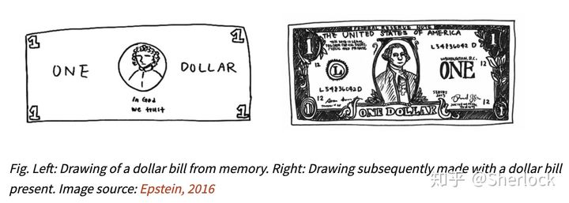

# Reference：

https://zhuanlan.zhihu.com/p/108625273

## Abstract:

self-supervised learning 是无监督学习里面的一种，主要是希望能够学习到一种通用的特征表达用于下游任务。

### Generative Methods

这类方法主要关注 pixel space 的重建误差，大多以 pixel label 的 loss 为主 

### Contrasive self-supervised learning

这类方法并不要求模型能够重建原始输入，而是希望模型能够在特征空间上对不同的输入进行分辨

### 两种方法的联系：

 对于一张人民币，我们能够很轻易地分辨其真假，说明我们对其已经提取了一个很好的特征表达，这个特征表达足够去刻画人民币的信息， 但是如果你要我画一张一模一样的人民币的图片，我肯定没法画出来。 通过这个例子可以明显看出，要提取一个好的特征表达的充分条件是能够重建，但是并不是必要条件，所以有了下面这一类方法。

