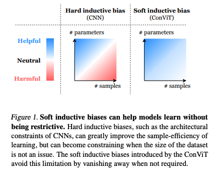
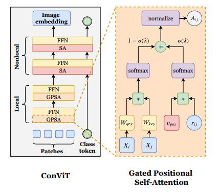

**A Survey on Visual Transformer** https://arxiv.org/pdf/2012.12556.pdf

**Transformers in Vision: A Survey** https://arxiv.org/pdf/2101.01169.pdf

* https://zhuanlan.zhihu.com/p/341995737

* [ ] **Deformable - DETR**
* [ ] **ViT** https://arxiv.org/pdf/2006.03677.pdf
* [ ] MLP-Mixer https://arxiv.org/pdf/2105.01601.pdf  
* [ ] local self attention 

# 目录：

[TOC]

## ViT

The results of ViT on image classification are encouraging, but its architecture is unsuitable for use as a general-purpose backbone network on dense vision tasks or when the input image resolution is high, due to its low-resolution feature maps and the quadratic increase in complexity with image size.

## ConViT 

https://arxiv.org/pdf/2103.10697.pdf

### introduction

* Convolutional architectures:Their hard inductive biases enable sample-efficient learning, but come at the cost of a potentially lower performance ceiling

- ViTs: outperformed CNNs. However, they require costly pre-training on large external datasets or distillation from pretrained convolutional networks 

Soft inductive biases / Hard inductive biases 

 a self-attention based model, which has a lower floor but a higher ceiling

### psa

$$
\boldsymbol{A}_{i j}^{h}:=\operatorname{softmax}\left(\boldsymbol{Q}_{i}^{h} \boldsymbol{K}_{j}^{h \top}+\boldsymbol{v}_{p o s}^{h \top} \boldsymbol{r}_{i j}\right)
$$

比SA来说多了一个跟位置相关的项，可以严格退化成conv（没看懂）
$$
\left\{\begin{array}{l}
\boldsymbol{v}_{\text {pos }}^{h}:=-\alpha^{h}\left(1,-2 \Delta_{1}^{h},-2 \Delta_{2}^{h}, 0, \ldots 0\right) \\
\boldsymbol{r}_{\delta}:=\left(\|\boldsymbol{\delta}\|^{2}, \delta_{1}, \delta_{2}, 0, \ldots 0\right) \\
\boldsymbol{W}_{q r y}=\boldsymbol{W}_{k e y}:=\mathbf{0}, \quad \boldsymbol{W}_{v a l}:=\boldsymbol{I}
\end{array}\right.
$$
根据原作者来说这样只能加速收敛，最高点反而还不如DeiT，于是做了改进，两项先各自softmax然后做了个gate相加，gate里面的权重是可学的。

## local attention & global attention

reference: https://zhuanlan.zhihu.com/p/80692530

global和local的区别：

其实就是个分组，但可能会抽取不同的feature

Q：不确定分组后weights是否会共享。类似local conv的思想， 计算量不变，只变参数量？

## Swin Transformer

Abstract： different from **language to vision** : such as large variations in the scale of visual entities and the high resolution of pixels in images compared to words in text.

**Architecture：**

**W-MSA and SW-MSA：**

$\Omega(\mathrm{MSA})=4 h w C^{2}+2(h w)^{2} C$
$\Omega(\mathrm{W}-\mathrm{MSA})=4 h w C^{2}+2 M^{2} h w C$

$\hat{\mathbf{z}}^{l}=\mathrm{W}-\mathrm{MSA}\left(\mathrm{LN}\left(\mathbf{z}^{l-1}\right)\right)+\mathbf{z}^{l-1}$
$\mathbf{z}^{l}=\mathrm{MLP}\left(\mathrm{LN}\left(\hat{\mathbf{z}}^{l}\right)\right)+\hat{\mathbf{z}}^{l}$,
$\hat{\mathbf{z}}^{l+1}=\mathrm{SW}-\mathrm{MSA}\left(\mathrm{LN}\left(\mathbf{z}^{l}\right)\right)+\mathbf{z}^{l}$
$\mathbf{z}^{l+1}=\mathrm{MLP}\left(\mathrm{LN}\left(\hat{\mathbf{z}}^{l+1}\right)\right)+\hat{\mathbf{z}}^{l+1}$

1. Hight resolution： $ H/4*W/4 $  VS  $H/16*W/16 $

2. local attention

3. patch merging 类似pooling，但用的是linear layer 来降维

   

## Q&A

1. cls token 是怎么用的？ 丢进去迭代？那inference过程是怎么样的？
   1. cls token作为参数，inference过程固定。最后取f[:,0] 或者 f.mean(1)作为feature。