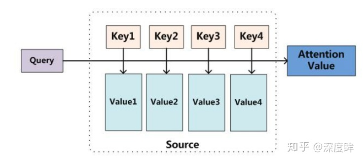
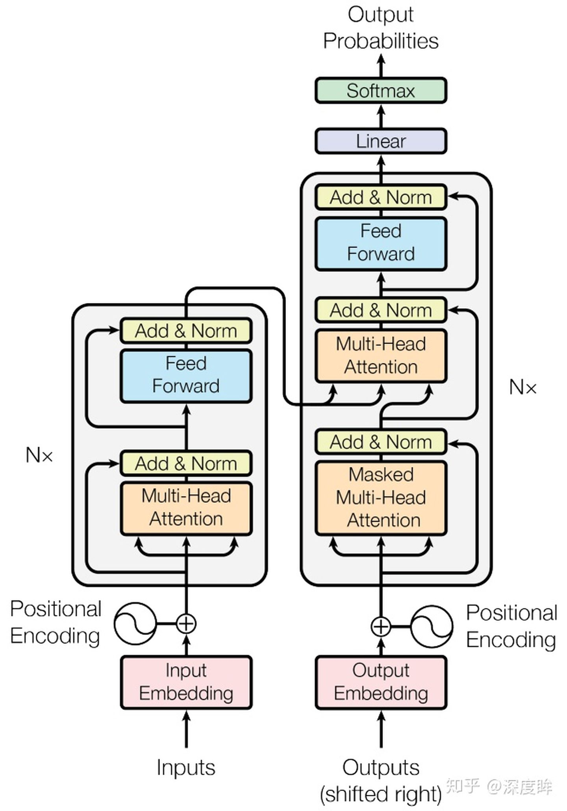
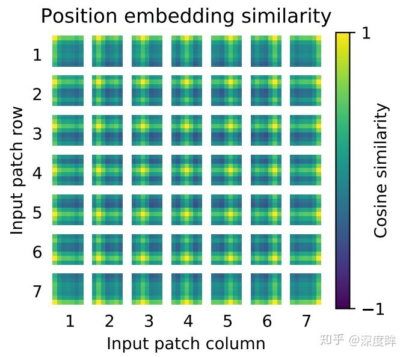

# Reference：

https://zhuanlan.zhihu.com/p/308301901

# 1. Attention is all your need

### 1. 什么叫attention

所有的attention都可以抽象成如下形式：

将Query(通常是向量)和4个Key(和Q长度相同的向量)分别计算相似性，然后经过softmax得到q和4个key相似性的概率权重分布，然后对应权重乘以Value(和Q长度相同的向量)，最后相加即可得到包含注意力的attention值输出。

~~~~Note
non-local就是这么来的
~~~~

### 2. Transformer：

### 3. 翻译任务流程：

以翻译任务为例：

- 将源单词进行嵌入，组成矩阵(加上位置编码矩阵)输入到n个编码器中，输出编码向量KV
- 第一个解码器先输入一个BOS_WORD单词嵌入向量，后续解码器接受该解码器输出，结合KV进行第一次解码
- 将第一次解码单词进行嵌入，联合BOS_WORD单词嵌入向量构成矩阵再次输入到解码器中进行第二次解码，得到解码单词
- 不断循环，每次的第一个解码器输入都不同，其包含了前面时间步长解码出的所有单词
- 直到输出EOS_WORD表示解码结束或者强制设置最大时间步长即可

详细说明下循环解码过程：第一次解码，输入BOS_WORD单词嵌入向量，假设是(1,256)，而编码器输出始终不变是(100,256)，那么第一次解码过程是(1,256)+位置编码作为解码器输入，解码输出是(1,256)，经过fc层(参数shape是(256,10000))变成(1,10000)，10000是单词总数，此时就可以解码得到第一个单词i；接着将BOS_WORD和i都进行嵌入，得到(2,256)输入，同样运行，输出是(2,256)，经过fc是(2,10000)，此时不需要第一个维度输出只需要[-1,10000]既可以解码第二个单词，后面就一直迭代直到输出结束解码标注。

这个解码过程其实就是标准的seq2seq流程。到目前为止就描述完了整个标准transformer训练和测试流程。

# 2. 视觉领域的Transformer

### 1. VIT Vision Transformer

1. 图片分块和降维：因为transformer的输入需要序列，所以最简单做法就是把图片切分为patch，然后拉成序列即可。 假设输入图片大小是256x256，打算分成64个patch，每个patch是32x32像素
2. 位置编码也是必不可少的，长度应该是1024，这里做的比较简单，没有采用sincos编码，而是直接设置为可学习，效果差不多。可视化结果很不错：

### 2. Detr

1. 流程：

- 将(b,3,800,1200)图片输入到resnet50中进行特征提取,输出shape=(b,1024,25,38)
- 通过1x1卷积降维，变成(b,256,25,38)
- 利用sincos函数计算位置编码
- 将图像特征和位置编码向量相加，作为编码器输入，输出编码后的向量，shape不变
- 初始化全0的(100,b,256)的输出嵌入向量，结合位置编码向量和query_embed，进行解码输出，解码器输出shape为(6,b,100,256)，后面的解码器接受该输出，然后再次结合置编码向量和query_embed进行输出，不断前向
- 将最后一个解码器输出输入到分类和回归head中，得到100个无序集合
- 对100个无序集合进行后处理，主要是提取前景类别和对应的bbox坐标，乘上(800,1200)即可得到最终坐标,后处理代码如下：

paper reading

