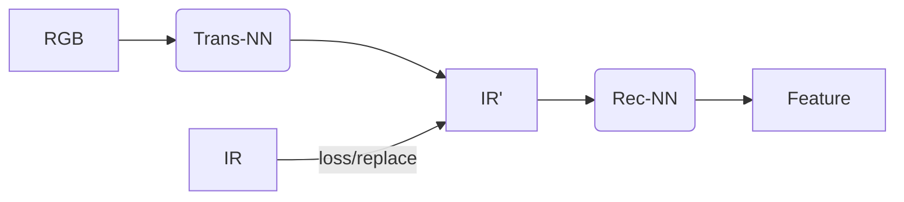
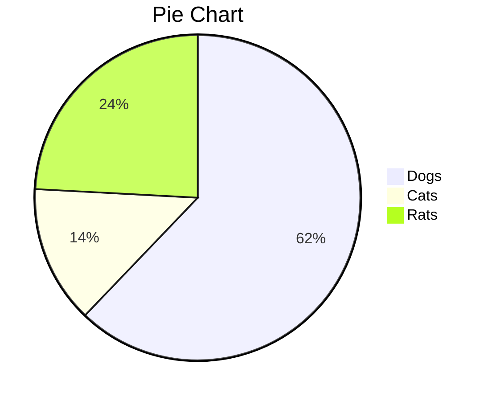

<details><summary>aa</summary>
  test
</details>


<font face="黑体">我是黑体字</font> <font face="微软雅黑">我是微软雅黑</font> <font face="STCAIYUN">我是华文彩云</font> <font color=red>我是红色</font> <font color=#008000>我是绿色</font> <font color=Blue>我是蓝色</font> <font size=5>我是尺寸</font> <font face="黑体" color=green size=5>我是黑体，绿色，尺寸为5</font>


```Mermaid
gantt
    title 甘特图的标题
    dateFormat  YYYY-MM-DD
    section Section
    A task           :a1, 2014-01-01, 30d
    Another task     :after a1  , 20d
    section Another
    Task in sec      :2014-01-12  , 12d
    another task      : 24d
```

````Mermaid
gantt
    title aa
    dateFormat  YYYY-MM-DD
    section Section
    A task           :a1, 2014-01-01, 30d
````


````details
test
````

<details><summary>aaa</summary>
  test
</details>


| aa   | aa   |
| ---- | ---- |
|      |      |


| aa   | aa   | aa   |
| ---- | ---- | ---- |
| aaa  |      |      |
| test |      |      |
| aa   |      |      |
|      |      |      |
|      |      |      |

<font color=#aa0000 size=72>color=#00ffff</font>

